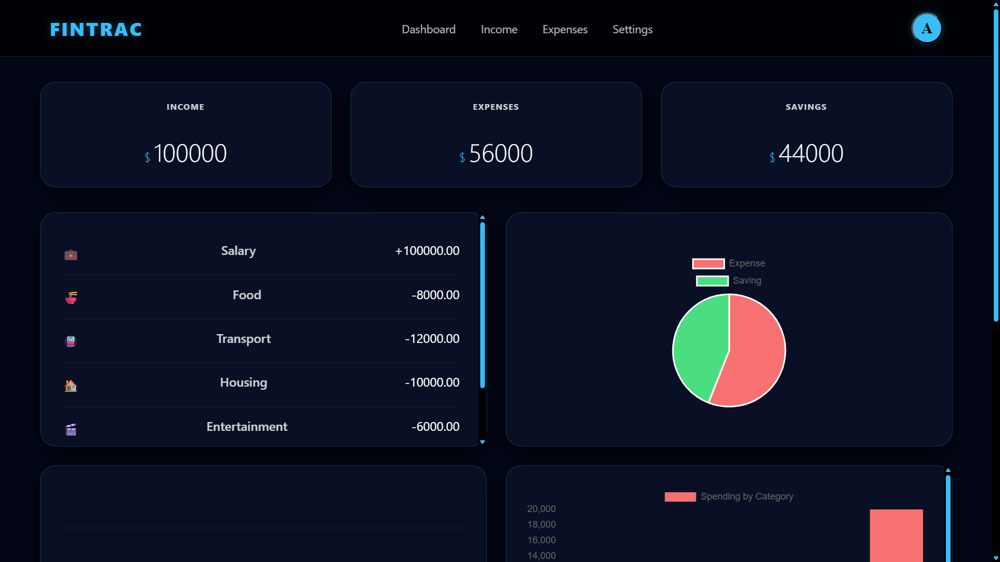
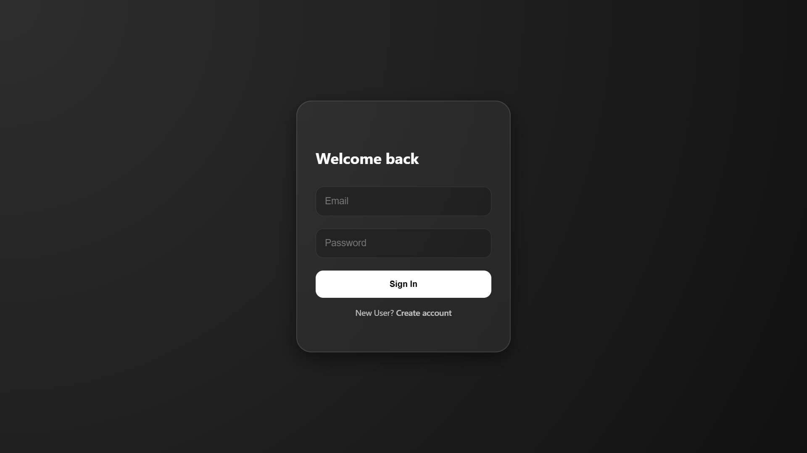
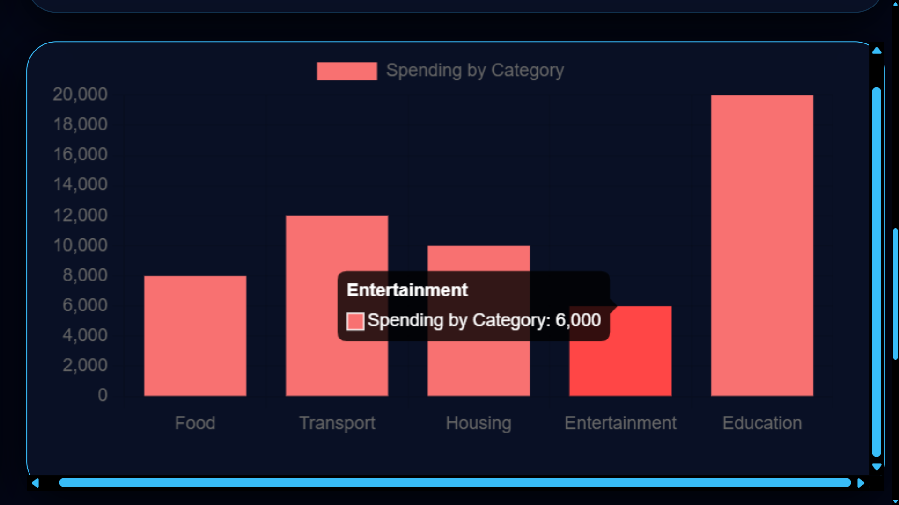

# 💰 FinanceApp

A full-stack personal finance tracker built to manage income, expenses, and budgets with a clean UI and insightful data visualization.

---

## 🚀 Features

* 🔐 JWT-based Authentication (Login/Register)
* 📊 Interactive Charts using Chart.js
* 💸 Track Income & Expenses separately
* 📁 Categorized Transactions
* 📅 Budget Management (monthly)
* 📈 Data Visualization (graphs & summaries)
* 🧠 Upcoming: Smart Budget Advice System

---

## 🛠️ Tech Stack

**Backend**

* Node.js
* Express.js
* MySQL
* JWT (Authentication)
* bcrypt (Password hashing)
* Zod (Validation)
* CORS

**Frontend**

* HTML
* CSS
* Vanilla JavaScript
* Chart.js

---

## 📂 Project Structure

```
FinanceApp/
│── Server/
│
│── frontend/
│   ├── Dashboard/
│   ├── login/
│
│── package.json
```

---

## ⚙️ Setup & Installation

### 1. Clone the repository

```bash
git clone <your-repo-link>
cd FinanceApp
```

### 2. Install dependencies

```bash
npm install
```

### 3. Setup environment variables

Create a `.env` file:

```
PORT=5000
JWT_SECRET_KEY=your_secret_key
DB_HOST=localhost
DB_USER=root
DB_PASSWORD=your_password
DB_NAME=finance_tracker
```

### 4. Setup database

* Import the provided `database.sql` file into MySQL
* Ensure tables (`users`, `transactions`, `categories`, `budgets`) are created

### 5. Run the server

```bash
npm start
```

---

## 📸 Screenshots

### Dashboard



### Login



### Charts



---

## 🔐 Authentication Flow

* User registers → password hashed using bcrypt
* JWT token issued on login/register
* Protected routes accessed using Bearer token

---

## 📌 Future Improvements

* 🤖 Smart Budget Advice System
* ⚛️ React Frontend Migration
* 📱 Responsive UI Enhancements
* 📊 Advanced Analytics

---

## 👨‍💻 Author

**Amrit Raj Yadav**

---

## 📄 License

This project is licensed under the MIT License.
